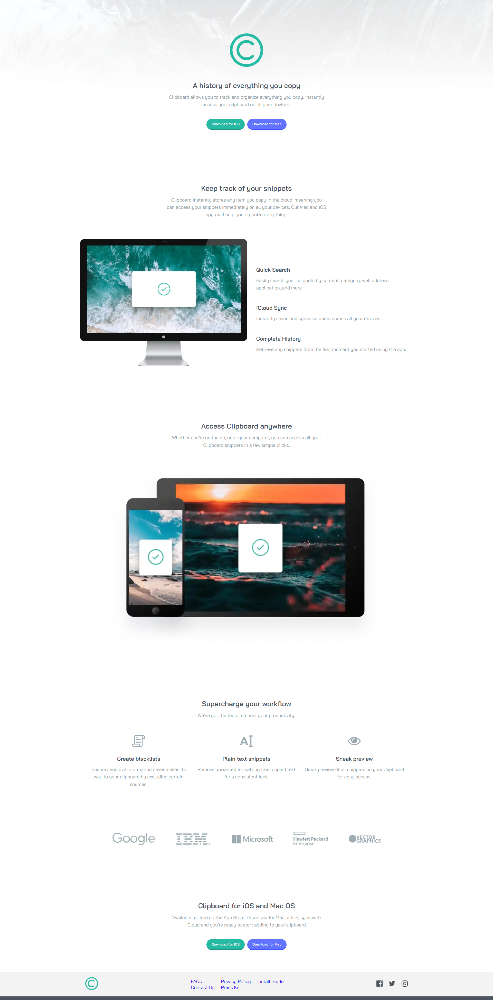

# Frontend Mentor - Clipboard landing page solution

This is a solution to the [Clipboard landing page challenge on Frontend Mentor](https://www.frontendmentor.io/challenges/clipboard-landing-page-5cc9bccd6c4c91111378ecb9). Frontend Mentor challenges help you improve your coding skills by building realistic projects. 

## Table of contents

- [Overview](#overview)
  - [The challenge](#the-challenge)
  - [Screenshot](#screenshot)
  - [Links](#links)
- [My process](#my-process)
  - [Built with](#built-with)
  - [Useful resources](#useful-resources)
- [Author](#author)

## Overview

### The challenge

Users should be able to:

- View the optimal layout for the site depending on their device's screen size
- See hover states for all interactive elements on the page

### Screenshot



### Links

- Solution URL: [Github Repo](https://github.com/abdelrhman492/clipcoard-landing-page)
- Live Site URL: [Click Me 😊](https://abdelrhman492.github.io/clipcoard-landing-page)

### Built with

- Semantic HTML5 markup
- SASS Preprocessor
- Flexbox
- Desktop-first workflow

To see how you can add code snippets, see below:

```HTML
<section class="home">
  <div class="container">
    <div class="logo">
      
    </div>
    <div class="content">
      <div class="title-container">
        <h1>A history of everything you copy</h1>
        <p>
          Clipboard allows you to track and organize everything you copy.
          Instantly access your clipboard on all your devices.
        </p>
      </div>
      <div class="buttons">
        <button class="success">Download for iOS</button>
        <button class="primary">Download for Mac</button>
      </div>
    </div>
  </div>
</section>
```
```css
body main .about .hero {
  margin-top: 80px;
}
body main .about .hero-image {
  max-width: 100%;
}
body main .about .hero-content {
  margin-top: 50px;
}
body main .about .hero-content .item {
  text-align: center;
  width: 80%;
  margin: auto;
}
body main .about .hero-content .item:not(:last-child) {
  margin-bottom: 50px;
}
```

### Useful resources

- [Mozilla Developer Network](https://developer.mozilla.org/en-US/docs/Web/CSS) - This helped me for css properties. I really liked this pattern and will use it going forward.
- [StackOverFlow](https://www.stackoverflow.com) - This is an amazing article which helped me finally understand how to improve the performance and accessability. I'd recommend it to anyone still learning this concept.

## Author

- Frontend Mentor - [@AbdElRhman492](https://www.frontendmentor.io/profile/AbdElRhman492)
